<div align="center">


<p>
<a href="https://github.com/dev-tejasnb"></a>
<a href="mailto:tejasnb03@gmail.com"></a>
<a href="https://linkedin.com/in/tejas-nb"></a>
</p>


</div>

---

# 👨‍💻 About Me

```yaml
Name: Tejas N B

Role: Full Stack Developer

Education: BCA Student

Location: Karnataka, India

Current Focus:
  - FastAPI
  - Next.js
  - AI Integrations
  - Cloud Deployment
  - SaaS Development

Learning:
  - DevOps
  - Kubernetes
  - System Design
```

---

# 🚀 What I'm Building

💻 Modern Full Stack Applications

⚡ High Performance APIs

🤖 AI Powered Projects

☁️ Cloud Ready Applications

🐳 Docker Deployments

🎮 Discord Automation

🔐 Authentication Systems

📊 Dashboard & Admin Panels

---

# 🛠 Tech Stack

### Languages

<p>

</p>

### Frontend

<p>

</p>

### Backend

<p>

</p>

### Database

<p>

</p>

### DevOps & Tools

<p>

</p>

---

# 📈 GitHub Analytics

<div align="center">





</div>

<br>

<div align="center">


</div>

---

# 🏆 GitHub Achievements

<div align="center">


</div>

<br>

<div align="center">


</div>

---

# 🐍 Contribution Snake

<p align="center">


</p>

---

# 📂 Featured Projects

🚀 Developer Portfolio

⚡ FastAPI REST APIs

🤖 Discord Bots

☁️ Cloud Automation

🔐 Authentication Platform

🛒 Software Deals Platform

---

# 🌱 Currently Exploring

- Artificial Intelligence
- Backend Optimization
- Kubernetes
- Cloud Infrastructure
- Scalable System Design
- Performance Engineering

---

# 💡 Quote

> **"Code with purpose. Build with passion. Learn without limits."**

---

<div align="center">

### ⭐ Thanks for visiting my profile!


</div>
